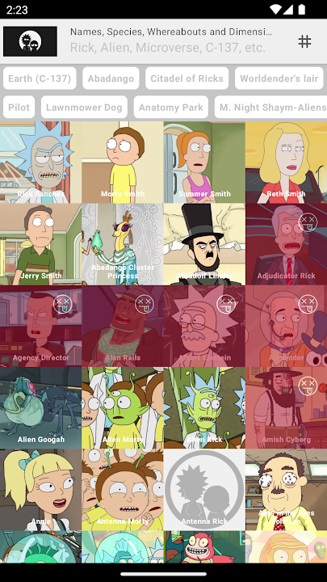
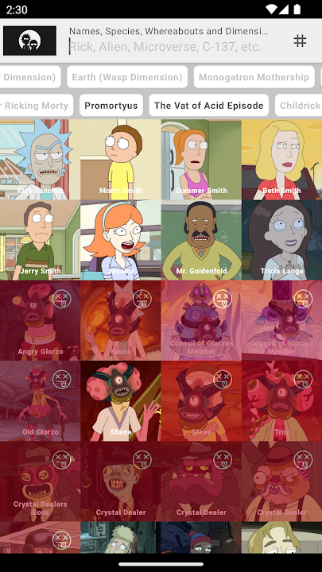
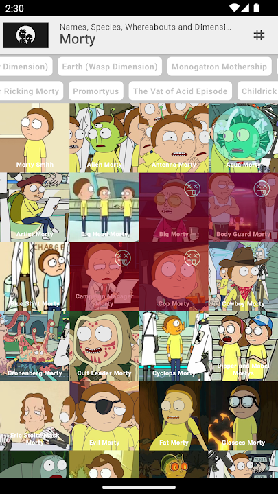
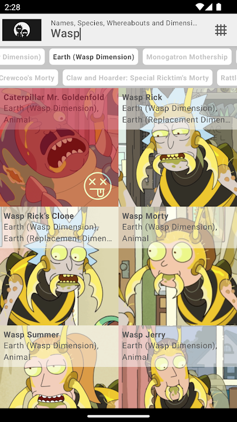

# A Ric(wi)kipedia of the multiverse!

The app was built using [RickAndMortAPI](https://rickandmortyapi.com/). Big shout out to the team 🎉🎉🎉

|  |   |  |  |
| - | - | - | - |

### No Ads, No hidden cost, No nothing! Just absolutely about techinal experimental and my passionate/addictive of infinite universes.
